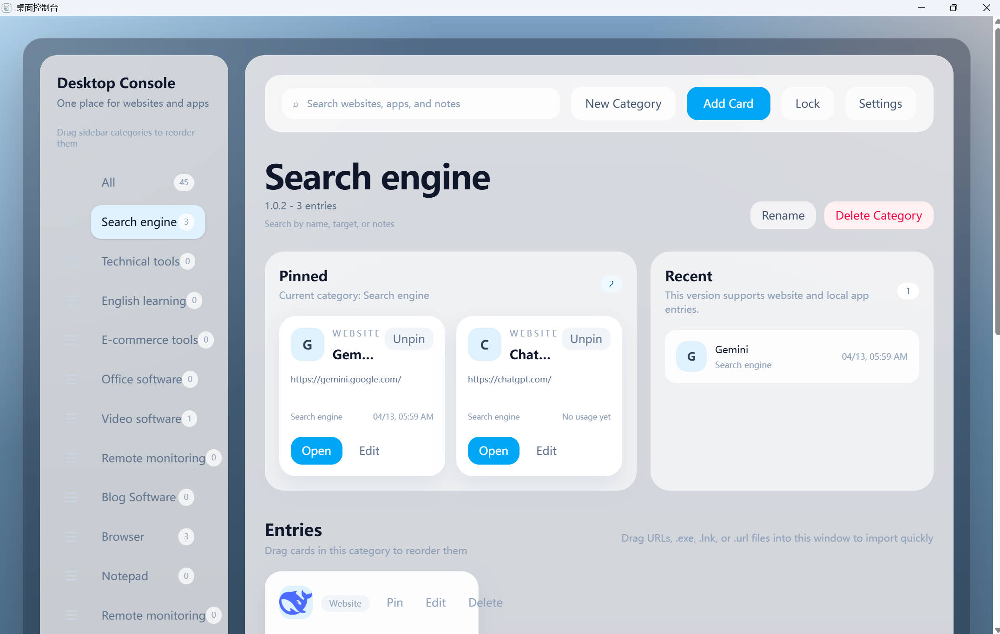
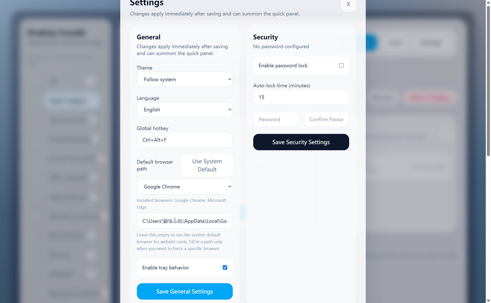
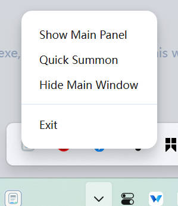
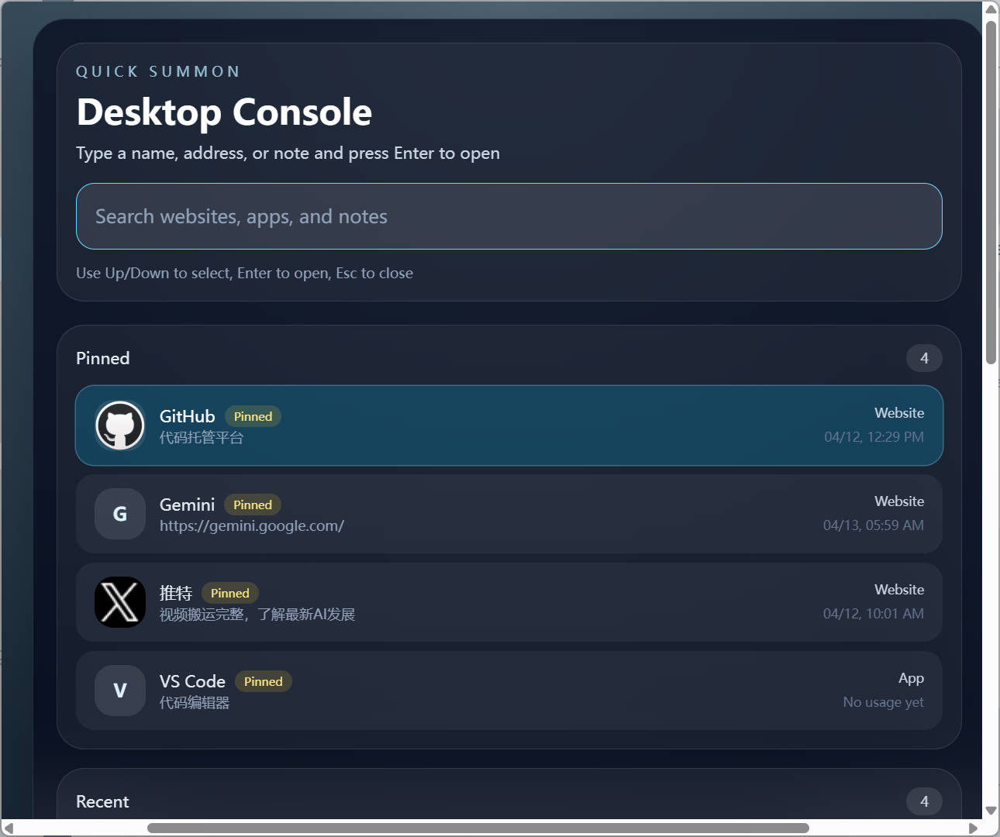

# Desktop Console


Desktop Console is a local-first Windows desktop launcher for managing websites, local applications, Windows shortcuts, and categorized work entries in one place.

It is designed for users who want a single control panel for daily tools, apps, and web destinations.

## Overview

Desktop Console helps you organize and open:

- Websites
- Local desktop applications
- Windows shortcuts
- Categorized workspaces
- Frequently used entries

## Interface



The interface is divided into 3 main areas:

1. Left sidebar: categories
2. Top action bar: search, create category, add card, settings
3. Main content area: pinned cards, recent items, and card list

## First-Time Setup

Recommended onboarding flow:

1. Create categories such as `Work`, `Study`, and `Tools`
2. Add website and app cards into the right categories
3. Open settings and configure tray behavior, hotkeys, and browser path

Additional notes:

- No manual database installation is required
- On first launch, the app creates its local database automatically
- On Windows, user data is stored by default at `%APPDATA%\\Desktop Console\\desktop-console.db`
- The packaged app does not include the developer's personal database

## Usage

### Create Categories

1. Click `New Category`
2. Enter a category name
3. Save it

Typical examples:

- Work
- Study
- Office Apps
- Tech Tools
- Common Sites

### Add a Website Card

1. Click `Add Card`
2. Select `Website`
3. Enter the name and URL
4. Choose a category
5. Save

Notes:

- Bare domains can be normalized to `https://...`
- The app can fetch the page title and favicon automatically

### Add an App Card

1. Click `Add Card`
2. Select `App`
3. Enter the app name
4. Enter an `.exe` path or a `.lnk` shortcut path
5. Choose a category
6. Save

Notes:

- `.exe` is supported
- `.lnk` is supported
- Windows shortcuts can be resolved into real executable paths and icons

### Drag-and-Drop Import

Supported items:

- URL
- `.exe`
- `.lnk`
- `.url`

How to use it:

1. Open a category
2. Drag a file or link into the window
3. Drop it to create a new card automatically

## Search, Pinning, and Settings

Use the search bar to search by:

- Card name
- Target path or URL
- Notes

Cards can be pinned so that important entries stay at the top. The app also tracks recently used entries to help you reopen them quickly.

Available settings include:

- System tray behavior
- Global hotkey
- Default browser path
- Password lock
- Auto-lock timing

If the browser path is left empty, website cards open with the system default browser. If a browser path is configured, website cards open with that browser instead.



## Tray and Hotkeys

When tray mode is enabled, closing the main window hides the app instead of exiting it.

Typical tray menu actions:

- Show Main Panel
- Quick Summon
- Hide Main Window
- Exit

A configured global hotkey can bring the app back instantly.





## Development

Install dependencies:

```powershell
npm.cmd install
```

Start the development app:

```powershell
npm.cmd run start
```

Run checks:

```powershell
npm.cmd run typecheck
npm.cmd run lint
```

## Packaging

Package the app:

```powershell
npm.cmd run package
```

Build installer artifacts:

```powershell
npm.cmd run make
```

For full packaging instructions, see [docs/App-Packaging-Guide-English.md](./docs/App-Packaging-Guide-English.md).

## Tech Stack

- Electron Forge
- Vite
- React 19
- TypeScript
- better-sqlite3
- i18next
- Zustand

## Documentation

- English user guide: [docs/User-Guide-English.md](./docs/User-Guide-English.md)
- Chinese user guide: [docs/使用教程-中文版.md](./docs/%E4%BD%BF%E7%94%A8%E6%95%99%E7%A8%8B-%E4%B8%AD%E6%96%87%E7%89%88.md)
- English packaging guide: [docs/App-Packaging-Guide-English.md](./docs/App-Packaging-Guide-English.md)
- Chinese packaging guide: [docs/应用打包教程.md](./docs/%E5%BA%94%E7%94%A8%E6%89%93%E5%8C%85%E6%95%99%E7%A8%8B.md)

## License

This project is open-sourced for learning and non-commercial use only.
Commercial use is strictly prohibited.
本项目开源仅供学习与非商业用途，**禁止商用**。
