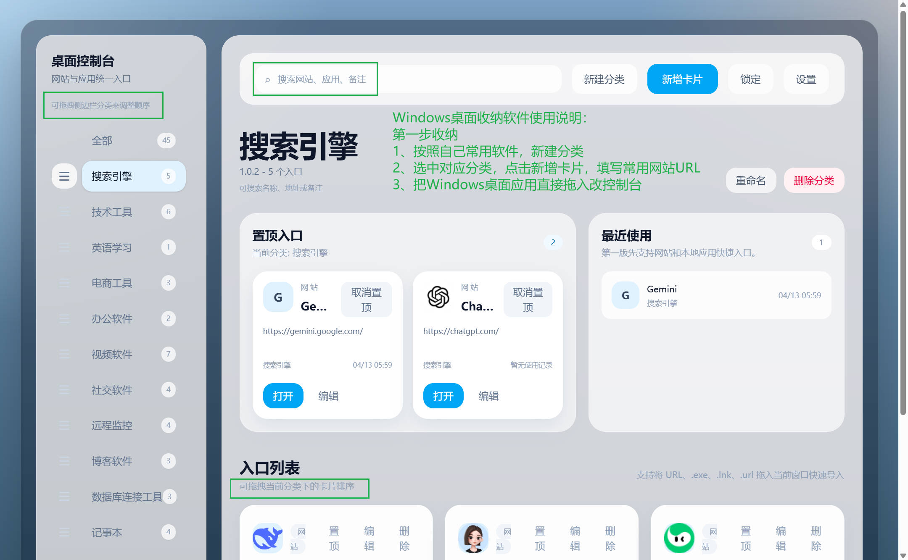
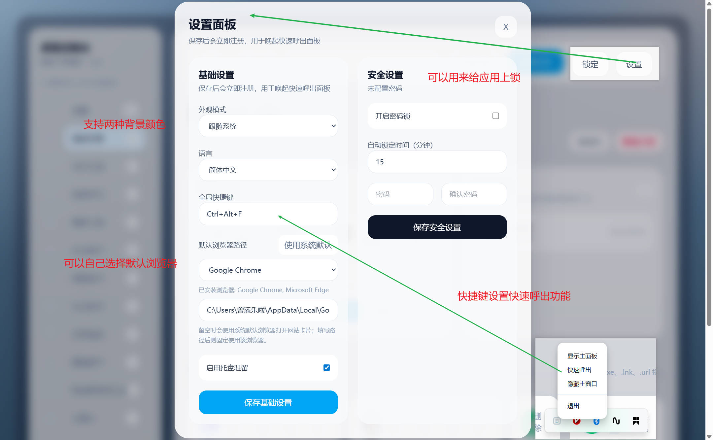
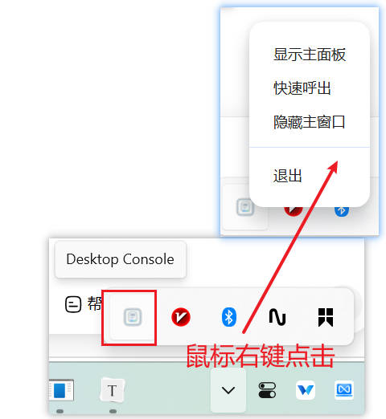
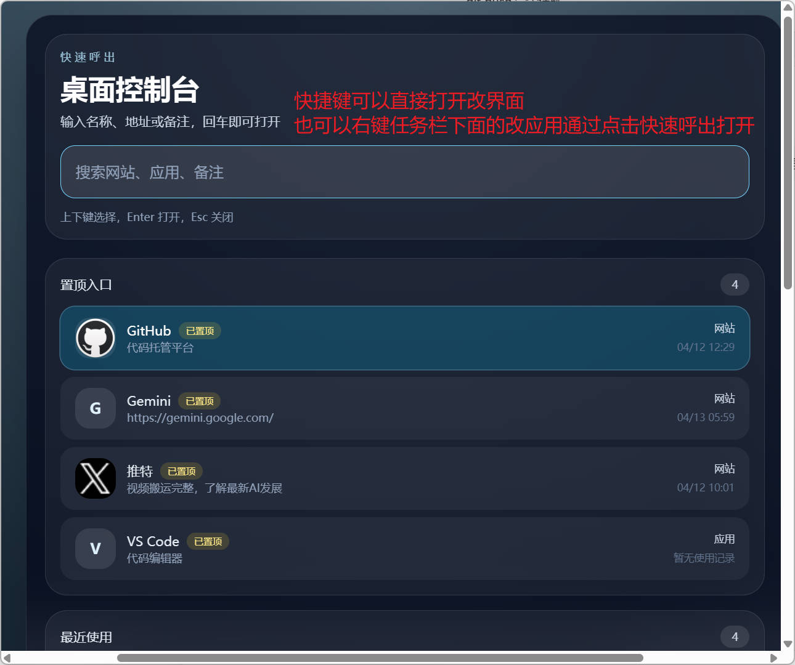

# 桌面控制台使用教程（中文版）

## 1. 应用作用

桌面控制台是一款用于统一管理“网站入口 + 本地应用入口”的桌面工具。

它适合这些场景：

- 把常用网站集中到一个地方打开
- 把常用软件和 Windows 快捷方式统一整理
- 按分类整理工作、学习、办公、工具入口
- 通过搜索、托盘和快捷键快速访问常用内容

## 2. 应用界面预览

界面主要由 3 部分组成：

1. 左侧分类栏：用于查看和切换分类
2. 顶部操作栏：用于搜索、新建分类、新增卡片、设置
3. 右侧内容区：用于显示卡片列表、置顶入口和最近使用记录

## 3. 首次使用建议

第一次使用时，建议按下面顺序操作：

1. 先创建几个分类，例如“工作”“学习”“常用工具”
2. 再分别往分类中添加网站或应用卡片
3. 最后到设置中配置快捷键、托盘和默认浏览器

补充说明：

- 用户不需要手动安装数据库
- 应用第一次启动时会自动创建本地数据库、自动建表，并写入默认数据
- Windows 下用户数据默认保存在 `%APPDATA%\\Desktop Console\\desktop-console.db`
- 例如：`C:\\Users\\你的用户名\\AppData\\Roaming\\Desktop Console\\desktop-console.db`
- 发布包 `version` 目录里的程序不会附带开发者自己的个人数据库

## 4. 新建分类

操作方式：

1. 点击左侧或顶部的 `新建分类`
2. 输入分类名称
3. 点击保存

适合的分类示例：

- 工作台
- 技术工具
- 常用网站
- 办公软件
- 学习资源

## 5. 新增卡片

### 5.1 新增网站卡片

你可以新增一个网站入口，例如 GitHub、Gitee、Notion、飞书等。

步骤：

1. 点击 `新增卡片`
2. 类型选择 `网站`
3. 输入名称和网址
4. 选择所属分类
5. 点击保存

说明：

- 裸域名通常会自动补成 `https://`
- 网站会自动尝试抓取标题和图标

### 5.2 新增应用卡片

你可以新增一个本地应用入口，例如 VS Code、微信、Typora、企业微信等。

步骤：

1. 点击 `新增卡片`
2. 类型选择 `应用`
3. 输入应用名称
4. 输入 exe 路径或快捷方式路径
5. 选择所属分类
6. 点击保存

说明：

- 支持 `.exe`
- 支持 `.lnk`
- 支持从快捷方式解析真实程序图标与目标路径

## 6. 拖拽导入

桌面控制台支持将资源直接拖入窗口导入。

支持的内容：

- URL
- `.exe`
- `.lnk`
- `.url`

步骤：

1. 先进入一个具体分类
2. 从桌面把文件快捷键或者exe软件拖到窗口中
3. 松开鼠标后自动创建卡片
4. 也可以直接在页面创建卡片复制导入常用的url

快捷方式示例：

## 7. 搜索与快速访问

你可以通过顶部搜索栏快速搜索：

- 卡片名称
- 目标地址
- 备注内容

适合在卡片较多时快速定位入口。

## 8. 置顶与最近使用

卡片支持置顶，便于把最常用的入口固定在前面。

应用还会记录最近使用内容，方便快速回到刚刚打开过的资源。

## 9. 设置说明

设置中可以配置：

- 托盘驻留
- 全局快捷键
- 默认浏览器路径
- 密码锁
- 自动锁定时间

建议：

- 如果经常通过键盘呼出，可以设置全局快捷键
- 如果网站默认需要特定浏览器打开，可以在设置里指定浏览器路径

数据说明：

- 浏览器路径留空时，网站卡片会使用系统默认浏览器打开

- 如果手动指定了浏览器路径，网站卡片会固定使用该浏览器打开

- 你的卡片、分类、设置和密码锁数据都会保存在本机用户目录，不会写进发布包目录

  

## 10. 托盘与快捷键

启用托盘后，关闭主窗口不会直接退出应用，而是隐藏到托盘。

托盘菜单通常包括：

- 显示主面板
- 快速呼出
- 隐藏主窗口
- 退出

如果你配置了全局快捷键，可以在任意界面快速唤起应用。

## 11. 常见使用建议

推荐做法：

1. 给分类起清晰名字
2. 把常用卡片置顶
3. 为应用卡片尽量使用真实可执行文件或有效快捷方式
4. 定期整理不再使用的入口

## 12. 附加建议

这款工具用于收纳常用桌面软件与网站，方便快速启动。推荐搭配开源工具 **Everything** 一起使用，可实现文件与文件夹的极速检索。

软件完全按照我个人的使用习惯与审美开发。如果你对 Desktop Console 有其他想法，也可以直接前往 GitHub 获取源码进行二次修改。本项目完全免费开源，欢迎大家在 GitHub 上点亮 Star 支持一下！

